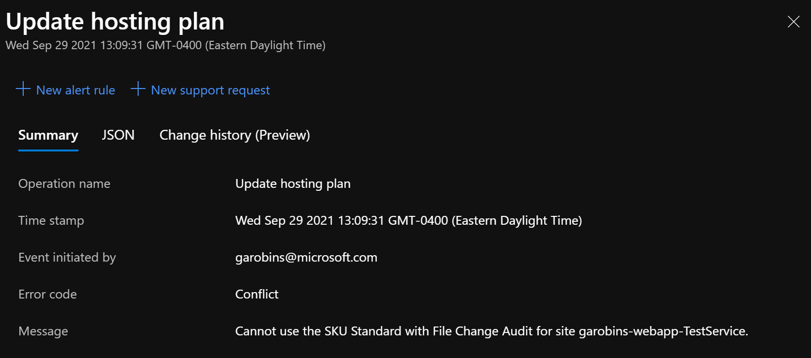
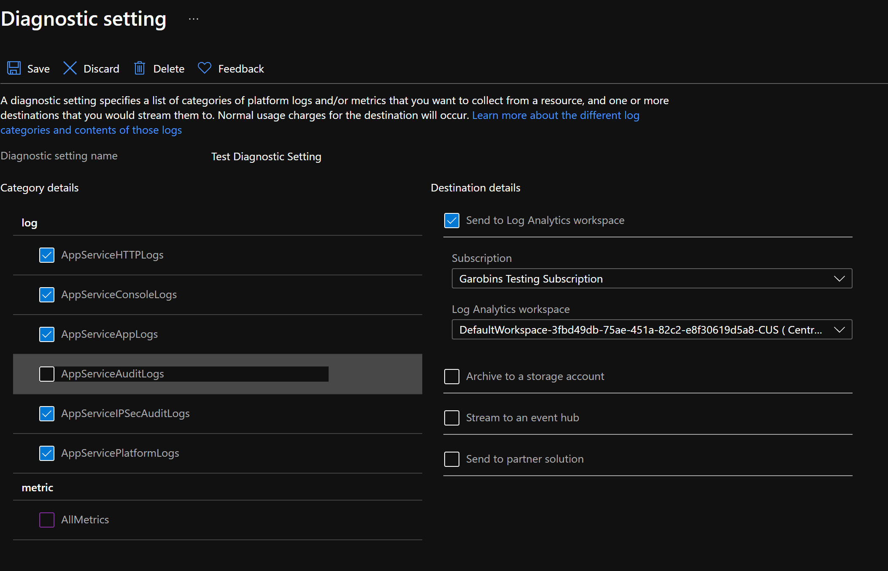

### Error when attempting to scale down App Service Plan from P1V2 SKU to Standard SKU
---

The customer has an issue when attempting to scale down their App Service Plan from P1V1 SKU to Standard SKU. When attempting to scale via Azure Portal the customer is shown the following error message:

```json
{
  "Error code": "Conflict",
  "Cannot use the SKU Standard with File Change Audit for site garobins-webapp-TestService."
}
```
<!--

-->

### Troubleshooting
---
In this scenario **File Change Audit** was referencing my AppServiceFileAuditLogs Diagnostic setting (not shown) that was enabled. In the illustration below it shows the AppServiceAuditLogs setting that I also disabled but after disabling this setting the AppServiceFileAuditLogs setting no longer appears. 


     
     
### Resolution
---
After disabling the AppServiceFileAuditLogs in the Diagnostic settings the customer was able to successfully scale their App Service Plan down from P1V2 SKU to Standard SKU. 

